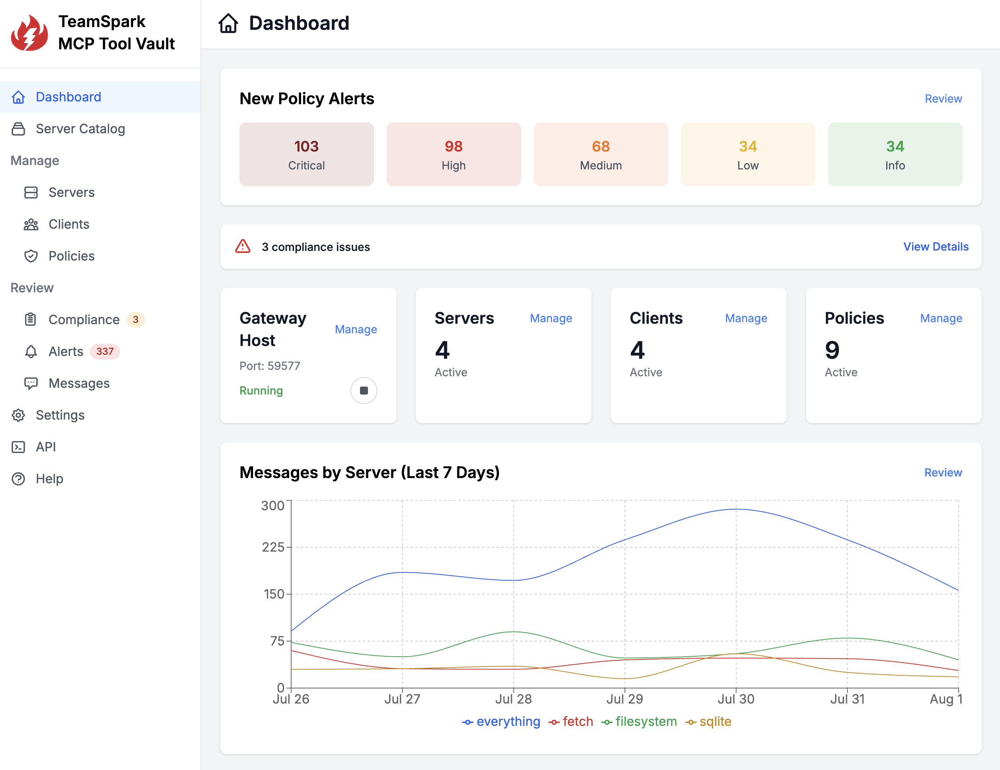

# TeamSpark MCP ToolVault

[](https://www.npmjs.com/package/toolvault)
[](https://github.com/TeamSparkAI/toolvault/blob/main/LICENSE.md)
[](https://github.com/TeamSparkAI/toolvault/stargazers)
[](https://discord.gg/Z2dh4ATXnB)

**An integrated platform for AI agent tool management and security**



## Overview

ToolVault helps you discover AI agents on your machine, import them, and convert their MCP server usage to managed and secure in one click.

Install new MCP servers from our catalog with one click, automatically deploy to the agents or projects that need them.

Apply security policies to the traffic flowing between agents and MCP servers to protect your API tokens, secrets, PII, and more.

Manage all of your MCP servers centrally, review message traffic, and monitor policy alerts.

For more product information, documentation, videos, and resources, see the [ToolVault product page](https://teamspark.ai/toolvault) on our website.

## Installation Requirements

Node.js v18+ and Docker (or compatible, aliased runtime)

Supported operating systems: MacOS, Windows, and Linux

## Installation Instructions

Install (toolvault and tsh)

```bash
npm install -g toolvault
```

Run

```bash
toolvault --port 3000
```

Help (list commands and config options)

```bash
toolvault -h
```

## Revert, clean up, and uninstall

We hope that everyone continues to use ToolVault after installation, and if you have any issues preventing you from doing so
we'd really appreciate hearing from you.  But if you do need to remove ToolVault, we have some commands that can help.

When you convert an MCP server to be managed by ToolVault we modify your IDE/agent tool config to point to our managed version
of the MCP server, but before we do that, we make a .tbk backup of the original configuration in place.  We do the same thing
if you add or import a client not using tools and we create the initial MCP config (we create an "empty" tbk backup).

Our revert process puts all configuration back where it was before we touched it (including removing MCP config files we created).
Any subsequent changes made by you to those files after we created the backup will be lost on revert.  

If you want review the configuration backups ToolVault has made, you can use `backups`:

```bash
toolvault --backups
```

And then to restore all configurations from their backups you can do `revert`:

```bash
toolvault --revert
```

To fully remove all ToolVault data from your system, you can do `clean` (which will do a `revert` first):

```bash
toolvault --clean
```

And then finally to uninstall:

```bash
npm uninstall -g toolvault
```

## Contact Us

Need help? Found a bug or have a feature request? Please join our [Discord server](https://discord.gg/Z2dh4ATXnB).

## License

This repository is licensed under the Business Software License.

License Terms: The Business Software License allows the work to be viewed and inspected, and used for personal, non-commercial purposes,
but it is not an open source license in the traditional sense. 

For more information, see the [Business Software License Agreement](LICENSE.md).

For commercial use licensing, please contact support@teamspark.ai.